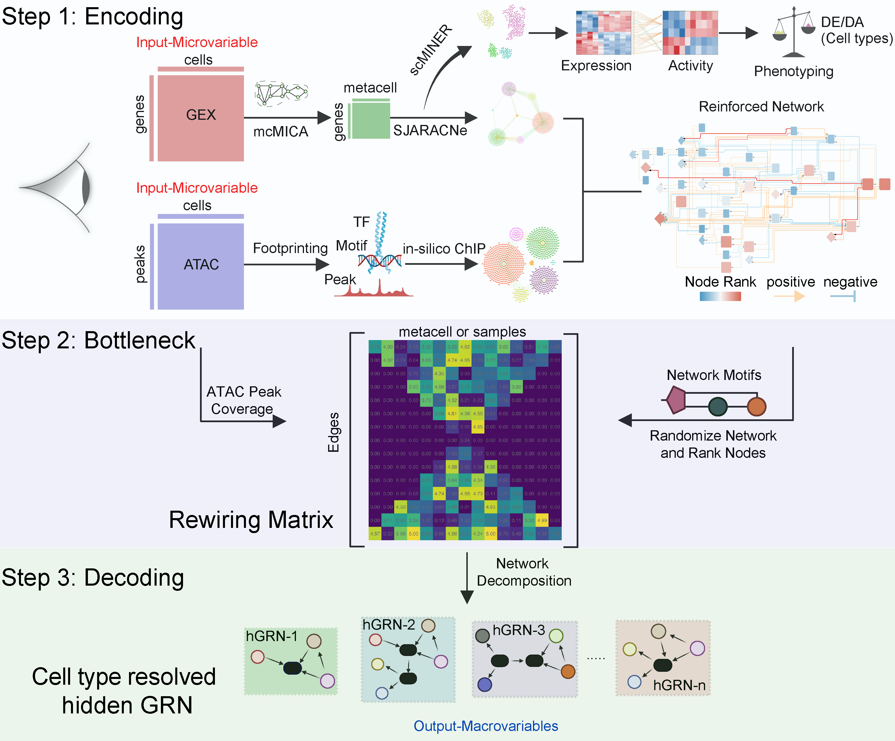

# Welcome to scMINER2 tutorial!

[**scMINER2**](https://github.com/jyyulab/scMINER2) is our attempt to build a causal feature learning framework to untangle cell type resolved hidden gene regulatory network (hGRN) using information from gene expression and chromatin accessibility.

**scMINER2** performs gene expression and chromatin accessibility data integration in 3 steps.
a. Encoding RNA and ATAC network
b. Reconstruction of bottleneck layer, a **Rewiring Matrix** 
c. Decoding the **Rewiring Matrix**. 

Through these series of analytical steps, **scMINER2** enables simultaneous inference of cellular differentiation trajectory and its underlying regulatory mechanisms. 

<figure>

<figcaption aria-hidden="true"><strong>Figure 1| scMINER2 - A causal feature learning framework to untangle cell type resolved hidden gene regulatory network (hGRN)</strong></figcaption>
</figure>
