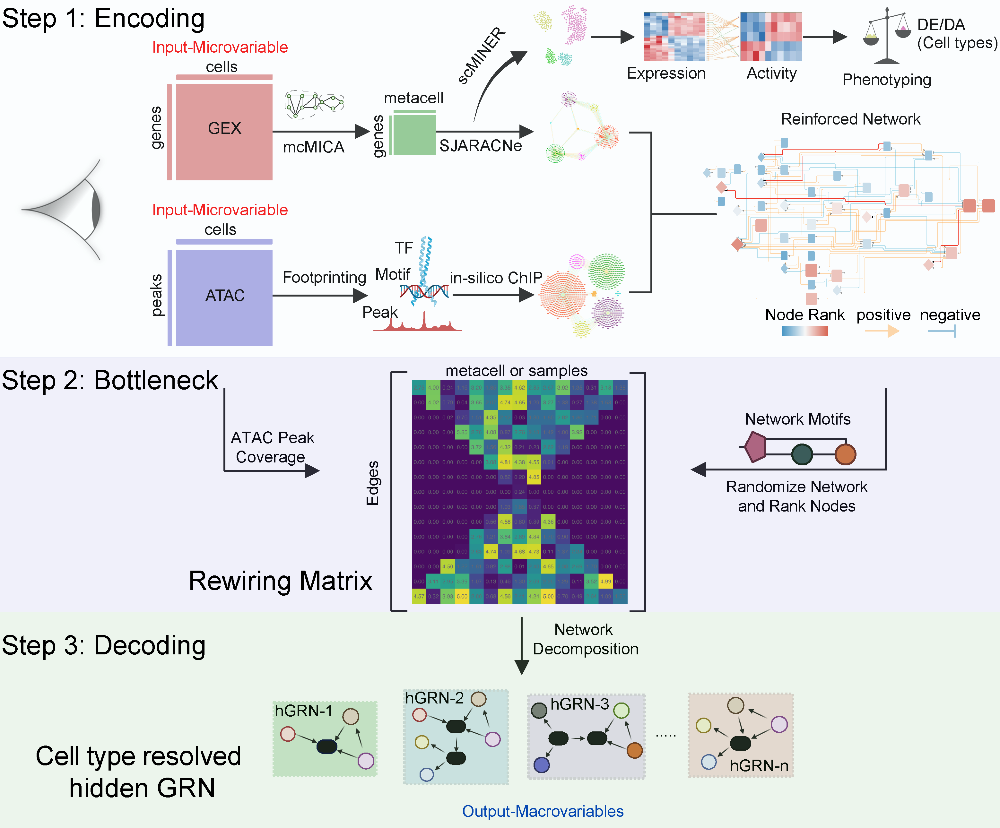

--- 
title: scMINER2
author: Yogesh Dhungana
date: "`r Sys.Date()`"
site: bookdown::bookdown_site
output: bookdown::gitbook
documentclass: book
bibliography: [book.bib]
biblio-style: apalike
cover-image: scMINER2/scMINER2.png
link-citations: yes
github-repo: https://github.com/itsyogeshd/scMINER2-tutorial
description: A causal feature learning framework for single-cell multiomics
---

# Welcome

Welcome to the [**scMINER2**](https://github.com/jyyulab/scMINER2) tutorial!

**scMINER2** is our attempt to build a *causal feature learning (CFL)* framework to untangle cell type resolved *hidden gene regulatory network (hGRN)* using molecular information from gene expression and chromatin accessibility.

**scMINER2** performs gene expression and chromatin accessibility data integration in 3 steps.\

a. Encoding gene expression and chromatin accessibility derived networks\
b. Reconstruction of the bottleneck layer, a **Rewiring Matrix**\
c. Decoding the **Rewiring Matrix**\

Through these series of analytical steps, **scMINER2** enables the user to simultaneously infer cellular differentiation trajectory and its underlying regulatory mechanisms. 

In this tutorial, we will provide detail workflow of single-cell chromatin accessibility data pre-processing using **ArchR** [package](https://github.com/GreenleafLab/ArchR) to help generate relevant inputs for the downstream **scMINER2** analysis followed by details of the analysis workflow and concepts related to **scMINER2** framework.

{width=100%}
